# AsesorIA

## Sistema RAG para consultas sobre información fiscal y normativa española

AsesorIA es un sistema de **Retrieval-Augmented Generation (RAG)** orientado a responder preguntas en lenguaje natural sobre información fiscal y normativa española dirigida principalmente a trabajadores autónomos.

El sistema combina ingesta documental, limpieza, segmentación por tokens, embeddings multilingües, recuperación semántica mediante ChromaDB y generación de respuestas fundamentadas en los documentos recuperados.

El objetivo principal no es únicamente generar respuestas plausibles, sino proporcionar respuestas **trazables, verificables y fundamentadas en el corpus documental**, reduciendo el riesgo de introducir información que no esté respaldada por las fuentes indexadas.

El proyecto utiliza fuentes documentales públicas y oficiales, lo que permite reproducir el sistema sin utilizar datos fiscales reales de contribuyentes.

---

# Índice

### Español

1. [Descripción general](#1-descripción-general)
2. [Problema y valor de negocio](#2-problema-y-valor-de-negocio)
3. [Arquitectura del sistema](#3-arquitectura-del-sistema)
4. [Flujo de consulta RAG](#4-flujo-de-consulta-rag)
5. [Grounding y trazabilidad](#5-grounding-y-trazabilidad)
6. [Evaluación del Retrieval](#6-evaluación-del-retrieval)
7. [Decisiones técnicas y justificación](#7-decisiones-técnicas-y-justificación)
8. [Prompting, abstención y control de respuestas](#8-prompting-abstención-y-control-de-respuestas)
9. [Governance, Ethics, Safety & Security](#9-governance-ethics-safety--security)
10. [Privacidad y PII](#10-privacidad-y-pii)
11. [Ingesta, corpus y metadatos](#11-ingesta-corpus-y-metadatos)
12. [Estructura del repositorio](#12-estructura-del-repositorio)
13. [Instalación](#13-instalación)
14. [Descarga e indexación del corpus](#14-descarga-e-indexación-del-corpus)
15. [Ejecución](#15-ejecución)
16. [Testing y calidad](#16-testing-y-calidad)
17. [Integración continua](#17-integración-continua)
18. [Observabilidad y latencia](#18-observabilidad-y-latencia)
19. [Auditoría y reproducibilidad](#19-auditoría-y-reproducibilidad)
20. [Cobertura de requisitos](#20-cobertura-de-requisitos)
21. [Estado actual](#21-estado-actual)
22. [Limitaciones conocidas](#22-limitaciones-conocidas)
23. [Evolución futura](#23-evolución-futura)
24. [Conclusión](#24-conclusión)

### English

1. [Overview](#1-overview)
2. [Problem and business value](#2-problem-and-business-value)
3. [System architecture](#3-system-architecture)
4. [RAG query flow](#4-rag-query-flow)
5. [Grounding and traceability](#5-grounding-and-traceability)
6. [Retrieval evaluation](#6-retrieval-evaluation)
7. [Technical decisions and rationale](#7-technical-decisions-and-rationale)
8. [Prompting, abstention and response control](#8-prompting-abstention-and-response-control)
9. [Governance, Ethics, Safety & Security](#9-governance-ethics-safety--security)
10. [Privacy and PII](#10-privacy-and-pii)
11. [Ingestion, corpus and metadata](#11-ingestion-corpus-and-metadata)
12. [Repository structure](#12-repository-structure)
13. [Installation](#13-installation)
14. [Corpus download and indexing](#14-corpus-download-and-indexing)
15. [Execution](#15-execution)
16. [Testing and quality](#16-testing-and-quality)
17. [Continuous integration](#17-continuous-integration)
18. [Observability and latency](#18-observability-and-latency)
19. [Auditability and reproducibility](#19-auditability-and-reproducibility)
20. [Requirements coverage](#20-requirements-coverage)
21. [Current status](#21-current-status)
22. [Known limitations](#22-known-limitations)
23. [Future evolution](#23-future-evolution)
24. [Conclusion](#24-conclusion)

---

# 1. Descripción general

AsesorIA implementa una arquitectura RAG para responder preguntas sobre documentación fiscal y normativa española.

El sistema sigue el principio:

> **Retrieval first, generation second.**

En lugar de depender exclusivamente del conocimiento paramétrico de un modelo de lenguaje, primero recupera fragmentos relevantes del corpus y posteriormente utiliza dichos fragmentos como contexto para generar la respuesta.

Esto permite:

* reducir la dependencia del conocimiento interno del LLM;
* utilizar documentación actualizable sin reentrenar el modelo;
* proporcionar evidencias de las respuestas;
* asociar las respuestas con documentos y páginas concretas;
* controlar el alcance documental de las consultas;
* implementar una estrategia de abstención cuando no existe evidencia suficiente.

El corpus de evaluación utilizado en la versión actual está compuesto por documentación pública y oficial.

---

# 2. Problema y valor de negocio

La información fiscal presenta varias dificultades para un sistema de preguntas y respuestas tradicional:

* gran volumen documental;
* documentos extensos;
* terminología jurídica y fiscal;
* información dependiente del año;
* necesidad de localizar artículos, apartados y páginas concretas;
* riesgo de proporcionar información no respaldada por la documentación.

Para un autónomo, una búsqueda convencional puede requerir consultar múltiples documentos y localizar manualmente la información relevante.

AsesorIA pretende reducir esta fricción mediante una interfaz conversacional que permite formular preguntas en lenguaje natural y obtener:

1. una respuesta generada a partir del contexto recuperado;
2. los fragmentos documentales utilizados;
3. metadatos de procedencia;
4. información de página y sección cuando está disponible;
5. una indicación de abstención cuando la evidencia documental no resulta suficiente.

### Valor de negocio

El sistema puede servir como capa de consulta sobre documentación fiscal sin sustituir el criterio profesional de un asesor.

Sus principales beneficios son:

* reducción del tiempo de búsqueda documental;
* acceso conversacional a información técnica;
* trazabilidad de las respuestas;
* mayor reproducibilidad de las consultas;
* posibilidad de actualizar el corpus sin modificar el modelo generativo;
* separación entre recuperación documental y generación.

El sistema debe considerarse una herramienta de apoyo y no un sustituto del asesoramiento fiscal profesional.

---

# 3. Arquitectura del sistema

La arquitectura se divide en varias etapas independientes:

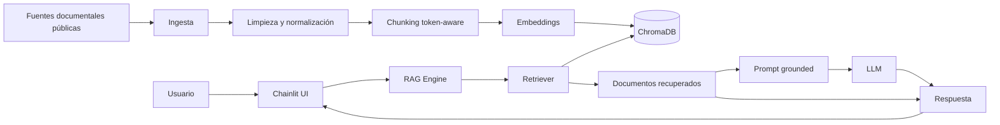

### Componentes principales

| Componente          | Responsabilidad                                   |
| ------------------- | ------------------------------------------------- |
| Loaders             | Lectura de PDF, TXT y Markdown                    |
| Cleaning            | Normalización y limpieza documental               |
| Chunking            | División de documentos en fragmentos recuperables |
| Embeddings          | Representación vectorial de los fragmentos        |
| ChromaDB            | Persistencia e indexación vectorial               |
| Retriever           | Recuperación semántica y aplicación de filtros    |
| RAG Engine          | Orquestación de retrieval y generación            |
| LLM                 | Generación de la respuesta basada en contexto     |
| Chainlit            | Interfaz conversacional                           |
| Pydantic            | Contratos y validación estructural                |
| SQLite / SQLAlchemy | Persistencia configurable de la interfaz          |
| Tests               | Validación de componentes y comportamiento        |
| GitHub Actions      | Automatización de CI                              |

---

# 4. Flujo de consulta RAG

Una consulta sigue aproximadamente este flujo:

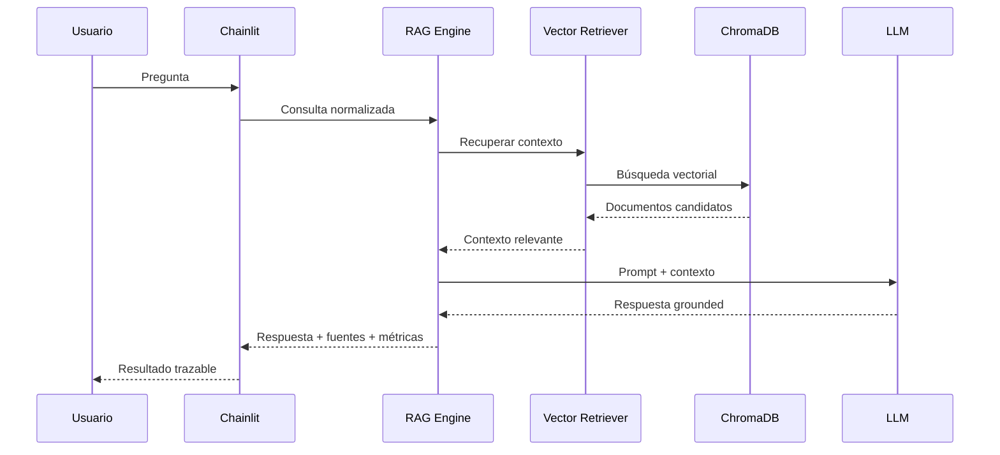

La recuperación precede a la generación.

Esto es importante porque el modelo no recibe únicamente la pregunta del usuario, sino también los fragmentos documentales recuperados.

---

# 5. Grounding y trazabilidad

Uno de los objetivos principales del proyecto es evitar que una respuesta aparentemente correcta pueda separarse de su evidencia documental.

Cada documento recuperado puede incorporar información como:

* `doc_id`
* `tax`
* `doc_type`
* `fiscal_year`
* `section_label`
* `section_path`
* `page`
* `page_end`
* `source_url`
* `retrieved_at`
* `source_scope`
* `session_id`
* `chunk_index`

El resultado de recuperación conserva además información sobre la similitud utilizada durante la búsqueda.

La respuesta final puede asociarse con los fragmentos que sirvieron como contexto.

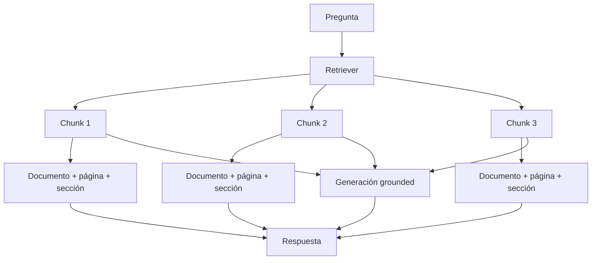

El objetivo de esta arquitectura es que la respuesta pueda ser inspeccionada desde la evidencia recuperada.

Esto no equivale a garantizar ausencia absoluta de alucinaciones: el grounding reduce el riesgo y permite auditar el contexto utilizado, pero la generación sigue dependiendo del comportamiento del modelo.

---

# 6. Evaluación del Retrieval

La recuperación se ha evaluado de forma independiente de la generación.

El benchmark utilizado contiene:

* **7 documentos oficiales**
* **2.847 páginas**
* **40 preguntas**

Distribución:

| Categoría            | Preguntas |
| -------------------- | --------: |
| Directas             |        28 |
| Dependientes del año |         2 |
| Sin respuesta        |         2 |
| Casos personales     |         4 |
| Fuera de alcance     |         4 |
| **Total**            |    **40** |

La evaluación utiliza principalmente:

* `document-hit@k`
* `referenced-page-hit@k`

No se denominan Recall@k porque el benchmark no contiene una anotación exhaustiva de todos los chunks relevantes del corpus.

### Resultados de referencia

Configuración V1:

* chunk size: **256 tokens**
* overlap: **32 tokens**
* top-k: **8**
* similarity threshold: **0.82**
* embeddings: `intfloat/multilingual-e5-base`

Resultados observados:

| Configuración | Document hit@8 | Referenced-page hit@8 |
| ------------- | -------------: | --------------------: |
| 256 / 32      |        30 / 30 |               24 / 28 |
| 384 / 48      |        29 / 30 |               24 / 28 |
| 480 / 64      |        30 / 30 |               24 / 28 |

La configuración **256/32** fue seleccionada como configuración V1 porque mantiene el rendimiento observado de recuperación documental y proporciona fragmentos más pequeños, reduciendo el contexto que debe transportar el sistema hacia la generación.

La evaluación se encuentra respaldada por scripts y documentación específicos del proyecto.

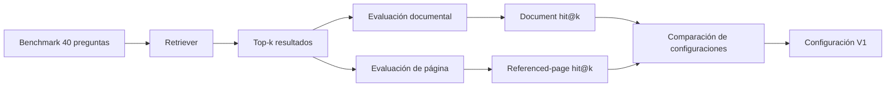

---

# 7. Decisiones técnicas y justificación

## 7.1 LangChain

LangChain proporciona las abstracciones utilizadas para:

* documentos;
* retrievers;
* embeddings;
* composición de componentes;
* integración del pipeline RAG.

El proyecto utiliza `Document` y componentes compatibles con el ecosistema LangChain.

LlamaIndex no forma parte del núcleo actual del sistema.

---

## 7.2 ChromaDB

ChromaDB se utiliza como almacén vectorial persistente.

La elección responde a:

* integración sencilla con Python;
* persistencia local;
* soporte de búsqueda vectorial;
* facilidad para reproducir el entorno;
* adecuación al tamaño del corpus de desarrollo y evaluación.

---

## 7.3 Embeddings

El modelo seleccionado es:

```text
intfloat/multilingual-e5-base
```

La elección está relacionada con el carácter multilingüe del modelo y su adecuación a consultas y documentación en español.

La calidad de los embeddings afecta directamente al retrieval, por lo que su comportamiento se evalúa indirectamente mediante el benchmark de recuperación.

---

## 7.4 Chunking

La configuración V1 utiliza:

```text
chunk_size = 256 tokens
chunk_overlap = 32 tokens
```

Se utiliza segmentación basada en tokens en lugar de depender únicamente de caracteres.

La estrategia busca:

* evitar chunks excesivamente grandes;
* mantener contexto suficiente;
* reducir duplicación entre fragmentos;
* controlar el tamaño del contexto enviado al modelo;
* mejorar la recuperación de unidades documentales concretas.

La selección se realizó mediante comparación experimental con otras configuraciones.

---

## 7.5 Retrieval

Configuración V1:

```text
top_k = 8
similarity_threshold = 0.82
```

El retriever:

1. vectoriza la consulta;
2. consulta ChromaDB;
3. recupera candidatos;
4. aplica los filtros correspondientes;
5. descarta resultados por debajo del umbral;
6. devuelve documentos LangChain con sus metadatos.

El objetivo es evitar que la generación reciba indiscriminadamente grandes cantidades de contexto.

---

## 7.6 Chainlit

Chainlit proporciona la interfaz conversacional del proyecto.

La capa `ui/rag_adapter.py` desacopla la interfaz de los detalles internos del motor RAG.

Esta separación permite probar la lógica del sistema sin depender directamente de la interfaz gráfica.

---

# 8. Prompting, abstención y control de respuestas

La generación se diseña alrededor del contexto recuperado.

El principio funcional es:

```text
Pregunta del usuario
        +
Contexto recuperado
        ↓
Prompt grounded
        ↓
Respuesta
```

El sistema debe diferenciar entre:

* información respaldada por el corpus;
* información insuficientemente respaldada;
* preguntas fuera del alcance documental.

Cuando el corpus no proporciona evidencia suficiente, el comportamiento esperado es abstenerse en lugar de inventar una respuesta.

La arquitectura contempla estados como:

* respuesta grounded;
* ausencia de respuesta;
* motivo de abstención;
* fuentes recuperadas;
* métricas de latencia.

La abstención no significa que el sistema pueda detectar perfectamente todos los casos ambiguos. Es una estrategia de control que debe seguir siendo evaluada con casos negativos y preguntas fuera de alcance.

---

# 9. Governance, Ethics, Safety & Security

La aplicación trabaja con información fiscal, por lo que el diseño debe considerar riesgos técnicos y de uso.

## Governance

El proyecto mantiene separación entre:

* corpus;
* procesamiento documental;
* recuperación;
* generación;
* interfaz;
* evaluación.

Las decisiones relevantes de retrieval se documentan mediante experimentos y documentación del proyecto.

El corpus puede reconstruirse mediante un registro de fuentes y scripts de descarga.

---

## Ethics

El sistema debe presentarse como una herramienta de apoyo a la consulta documental.

No debe interpretarse como:

* asesoramiento fiscal profesional;
* sustituto de un asesor;
* autoridad legal;
* mecanismo automático para tomar decisiones fiscales vinculantes.

La utilización de fuentes públicas evita incorporar deliberadamente datos fiscales reales de contribuyentes al corpus de desarrollo.

---

## Safety

Los principales mecanismos de reducción de riesgo son:

* grounding sobre documentación recuperada;
* trazabilidad de las fuentes;
* abstención ante ausencia de evidencia;
* evaluación de preguntas sin respuesta;
* evaluación de preguntas fuera de alcance;
* separación entre retrieval y generation;
* validación de contratos de datos.

El sistema no garantiza una ausencia total de errores o alucinaciones.

---

## Security

Se consideran especialmente relevantes:

* aislamiento mediante `source_scope`;
* identificación de sesión mediante `session_id`;
* validación de datos;
* control de acceso cuando corresponde;
* separación entre documentos originales y artefactos generados;
* no inclusión de documentos originales del corpus en el repositorio Git.

Las medidas implementadas deben interpretarse como controles técnicos del proyecto y no como una certificación formal de seguridad.

---

# 10. Privacidad y PII

El proyecto incluye utilidades para detectar patrones de información potencialmente identificable en:

```text
src/privacy/pii.py
```

Actualmente se contemplan patrones relacionados con:

* IBAN;
* email;
* NIF;
* NIE;
* CIF;
* teléfono.

La detección es principalmente **pattern-based**.

Por tanto, no debe considerarse un sistema completo de detección semántica de PII ni un mecanismo equivalente a una solución especializada de DLP/NER.

El uso de documentación pública durante desarrollo y evaluación reduce el riesgo de exponer información fiscal real.

La arquitectura incorpora además:

```text
source_scope
session_id
```

para permitir una separación lógica del contexto y facilitar la trazabilidad.

---

# 11. Ingesta, corpus y metadatos

El pipeline de ingesta contempla:

* PDF;
* TXT;
* Markdown.

El flujo general es:

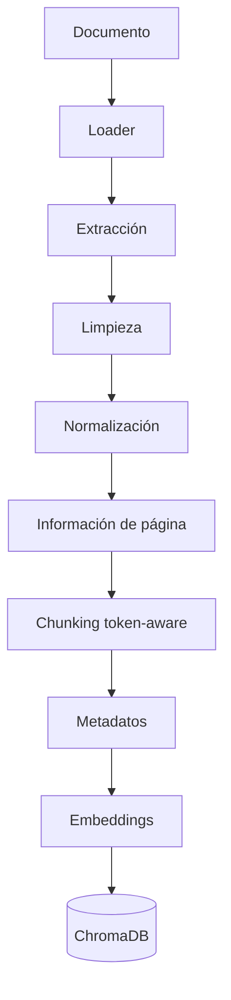

La extracción mantiene información de página cuando está disponible.

También se contemplan operaciones de limpieza y tratamiento de tablas para reducir ruido en el corpus.

El registro de fuentes se mantiene en:

```text
data/sources.csv
```

Los documentos originales del corpus no se incluyen como parte del repositorio Git.

---

# 12. Estructura del repositorio

La estructura funcional del proyecto se organiza alrededor de las siguientes áreas:

```text
AsesorIA/
├── data/
│   ├── eval/
│   └── sources.csv
│
├── docs/
│   ├── acceptance_criteria.md
│   ├── chunking_strategy.md
│   ├── corpus_cleaning_audit.md
│   ├── corpus_indexing.md
│   ├── embeddings.md
│   ├── retrieval_benchmark_audit.md
│   ├── retrieval_evaluation.md
│   ├── retrieval_evidence_review.md
│   ├── retrieval_threshold_experiment.md
│   ├── vector_retrieval.md
│   └── v1_retrieval_configuration.md
│
├── scripts/
│   ├── audit_corpus_cleaning.py
│   ├── audit_retrieval_benchmark.py
│   ├── benchmark_latency.py
│   ├── download_corpus.sh
│   ├── evaluate_retrieval.py
│   └── index_corpus.py
│
├── src/
│   ├── ingestion/
│   ├── indexing/
│   ├── retrieval/
│   ├── rag/
│   ├── privacy/
│   └── ...
│
├── tests/
│   ├── test_cleaning.py
│   ├── test_loaders.py
│   ├── test_chunking.py
│   ├── test_chunking_tokenizer.py
│   ├── test_tables.py
│   ├── test_embeddings.py
│   ├── test_embeddings_integration.py
│   ├── test_vectorstore.py
│   ├── test_retriever.py
│   ├── test_rag.py
│   ├── test_evaluate_retrieval.py
│   ├── test_index_corpus.py
│   ├── test_pii.py
│   ├── test_schemas.py
│   └── ...
│
├── ui/
│   ├── app.py
│   ├── rag_adapter.py
│   ├── persistence.py
│   └── mock_rag.py
│
├── requirements.txt
└── README.md
```

La estructura exacta puede evolucionar junto con el proyecto; el principio de organización es separar ingestión, indexación, retrieval, generación, interfaz y evaluación.

---

# 13. Instalación

## Requisitos

Se utiliza:

```text
Python 3.11
```

Se recomienda crear un entorno virtual.

### Linux / macOS

```bash
python3.11 -m venv .venv
source .venv/bin/activate
pip install -r requirements.txt
```

### Windows PowerShell

```powershell
py -3.11 -m venv .venv
.venv\Scripts\Activate.ps1
pip install -r requirements.txt
```

---

# 14. Descarga e indexación del corpus

El corpus se obtiene mediante el script:

```bash
bash scripts/download_corpus.sh
```

Posteriormente se genera el índice:

```bash
python -m scripts.index_corpus --index
```

El proceso conceptual es:

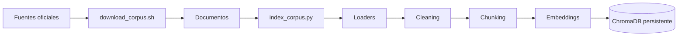

### Windows

Para evitar problemas relacionados con determinadas rutas de persistencia de ChromaDB, se recomienda utilizar una ruta ASCII, por ejemplo:

```text
C:/AsesorIA-data/chroma_db
```

La ubicación concreta puede configurarse según el mecanismo de persistencia utilizado por el proyecto.

---

# 15. Ejecución

Una vez instalado el proyecto y generado el índice, la interfaz puede iniciarse mediante Chainlit:

```bash
cd ui
chainlit run app.py
```

La interfaz permite interactuar con el sistema mediante preguntas en lenguaje natural.

El flujo de ejecución es:

```text
Usuario
  ↓
Chainlit
  ↓
RAG Adapter
  ↓
RAG Engine
  ↓
Retriever
  ↓
ChromaDB
  ↓
Contexto recuperado
  ↓
LLM
  ↓
Respuesta + fuentes + métricas
```

Existe además una implementación mock para facilitar determinadas pruebas y escenarios de desarrollo sin depender del modelo generativo.

---

# 16. Testing y calidad

El proyecto utiliza `pytest`.

Ejecución completa:

```bash
python -m pytest tests/ -q
```

Las pruebas cubren diferentes capas:

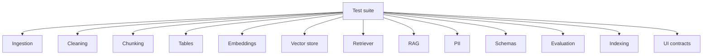

Entre las áreas cubiertas se encuentran:

* loaders;
* limpieza;
* chunking;
* tokenización;
* tablas;
* embeddings;
* vector store;
* retrieval;
* RAG;
* evaluación;
* indexación;
* PII;
* schemas;
* persistencia e interfaz.

La existencia de tests no implica que el sistema esté libre de errores; su objetivo es detectar regresiones y verificar contratos y comportamientos definidos.

---

# 17. Integración continua

El proyecto utiliza GitHub Actions para ejecutar automáticamente la suite de pruebas en cambios relevantes.

El flujo conceptual es:

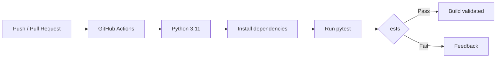

La configuración de CI utiliza credenciales dummy cuando una variable de entorno es necesaria para ejecutar pruebas, evitando depender de secretos personales.

---

# 18. Observabilidad y latencia

El motor RAG registra métricas relacionadas con el procesamiento de la consulta.

Se distinguen conceptualmente:

```text
retrieval latency
generation latency
total latency
```

Esto permite diferenciar si un problema de rendimiento procede de:

* búsqueda vectorial;
* preparación del contexto;
* generación del modelo;
* combinación de etapas.

La observabilidad es especialmente relevante en RAG porque una recuperación más compleja puede mejorar la evidencia pero aumentar el coste y la latencia.

---

# 19. Auditoría y reproducibilidad

La reproducibilidad es uno de los objetivos del proyecto.

Se mantienen artefactos específicos para documentar:

* estrategia de chunking;
* configuración V1;
* benchmark de retrieval;
* experimentos de threshold;
* revisión de evidencia;
* limpieza del corpus;
* indexación;
* embeddings.

Entre los scripts relevantes se encuentran:

```text
scripts/evaluate_retrieval.py
scripts/audit_corpus_cleaning.py
scripts/audit_retrieval_benchmark.py
scripts/benchmark_latency.py
scripts/index_corpus.py
```

La combinación de:

```text
source registry
        +
documented configuration
        +
evaluation benchmark
        +
automated tests
        +
CI
```

permite reproducir y auditar las principales decisiones técnicas del sistema.

---

# 20. Cobertura de requisitos

La siguiente tabla relaciona los requisitos funcionales y técnicos del proyecto con su implementación.

| Requisito                     | Implementación                                               |
| ----------------------------- | ------------------------------------------------------------ |
| Sistema RAG end-to-end        | Ingesta + embeddings + vector store + retrieval + generation |
| Preguntas en lenguaje natural | Interfaz Chainlit                                            |
| Grounding                     | Prompt basado en contexto recuperado                         |
| Reducción de alucinaciones    | Retrieval + threshold + abstención                           |
| Trazabilidad                  | Metadatos de documento, sección y página                     |
| PDF                           | Loader documental                                            |
| TXT                           | Loader documental                                            |
| Markdown                      | Loader documental                                            |
| Chunking documentado          | `docs/chunking_strategy.md`                                  |
| Embeddings                    | `intfloat/multilingual-e5-base`                              |
| Vector DB persistente         | ChromaDB                                                     |
| Orquestación                  | LangChain                                                    |
| Evaluación retrieval          | Benchmark automatizado                                       |
| Pruebas                       | pytest                                                       |
| CI                            | GitHub Actions                                               |
| PII                           | `src/privacy/pii.py`                                         |
| Auditoría                     | Scripts y documentación                                      |
| Reproducibilidad              | Registry + scripts + configuración documentada               |
| Seguridad                     | Controles de alcance, validación y separación de contexto    |
| Ética                         | Abstención, trazabilidad y delimitación del uso              |

La funcionalidad de **subida dinámica de documentos por parte del usuario final** no debe considerarse una capacidad plenamente implementada salvo que exista una implementación específica en la versión desplegada. El pipeline de ingesta sí permite incorporar nuevos documentos al corpus mediante el proceso de indexación.

---

# 21. Estado actual

| Área                                   | Estado                                                      |
| -------------------------------------- | ----------------------------------------------------------- |
| Ingesta documental                     | Implementada                                                |
| Limpieza                               | Implementada                                                |
| Chunking token-aware                   | Implementado                                                |
| Embeddings                             | Implementados                                               |
| ChromaDB                               | Implementado                                                |
| Retriever                              | Implementado                                                |
| RAG Engine                             | Implementado                                                |
| Chainlit UI                            | Implementada                                                |
| Grounding                              | Implementado                                                |
| Trazabilidad                           | Implementada                                                |
| Benchmark retrieval                    | Implementado                                                |
| PII detection                          | Implementada                                                |
| Tests                                  | Implementados                                               |
| CI                                     | Implementada                                                |
| Auditoría documental                   | Implementada                                                |
| Subida dinámica de documentos desde UI | No debe considerarse completa sin implementación específica |
| Producción empresarial completa        | Fuera del alcance actual                                    |

El proyecto debe considerarse una implementación funcional y evaluable de un sistema RAG, no una plataforma fiscal empresarial completamente desplegada en producción.

---

# 22. Limitaciones conocidas

## 22.1 Retrieval

El benchmark actual contiene 40 preguntas y proporciona una evaluación útil de la configuración V1, pero no representa todas las posibles consultas fiscales.

Además, las métricas utilizadas no constituyen una evaluación exhaustiva de Recall@k sobre todos los documentos relevantes del corpus.

---

## 22.2 Generación

El grounding reduce el riesgo de alucinación, pero no lo elimina.

Un LLM puede:

* interpretar incorrectamente un fragmento;
* combinar información de forma incorrecta;
* responder de forma demasiado general;
* generar una conclusión que no esté completamente justificada.

Por este motivo, la trazabilidad y la revisión humana siguen siendo importantes.

---

## 22.3 PII

La detección actual está basada principalmente en patrones.

No constituye una solución completa para:

* entidades sensibles no estructuradas;
* PII implícita;
* información identificable por combinación de campos;
* detección semántica avanzada.

---

## 22.4 Actualización normativa

La información fiscal cambia con el tiempo.

El sistema depende de que el corpus sea actualizado y posteriormente reindexado.

Por tanto, una respuesta puede ser técnicamente correcta respecto del corpus pero no representar la normativa vigente si el corpus está desactualizado.

---

## 22.5 Alcance

El sistema no pretende sustituir:

* asesores fiscales;
* abogados;
* organismos oficiales;
* procedimientos administrativos;
* validación profesional.

---

# 23. Evolución futura

Las siguientes mejoras constituyen líneas naturales de evolución:

### Retrieval

* evaluación sobre un benchmark más amplio;
* métricas adicionales;
* reranking;
* búsqueda híbrida;
* recuperación específica por tipo documental;
* evaluación temporal de normativa.

### Corpus

* actualización automática de fuentes;
* detección de cambios documentales;
* versionado de documentos;
* control de vigencia;
* mayor cobertura de normativa.

### PII y seguridad

* NER para entidades sensibles;
* detección contextual;
* redacción automática configurable;
* controles de acceso más granulares;
* auditoría avanzada de sesiones.

### Generation

* evaluación automática de groundedness;
* verificadores de citas;
* validación de claims;
* mejores estrategias de abstención;
* comparación sistemática de proveedores/modelos.

### Producto

* subida de documentos desde la interfaz;
* gestión de corpus;
* administración de fuentes;
* historial avanzado;
* visualización de evidencias;
* observabilidad de producción.

---

# 24. Conclusión

AsesorIA implementa un sistema RAG orientado a consultas sobre información fiscal y normativa española.

La arquitectura prioriza:

```text
Retrieval
    ↓
Evidence
    ↓
Grounded generation
    ↓
Traceability
    ↓
Evaluation
```

Las decisiones de chunking y retrieval no se han establecido únicamente de forma teórica, sino que se han contrastado mediante un benchmark documental.

La configuración V1 utiliza:

```text
Embedding model:
intfloat/multilingual-e5-base

Chunk size:
256 tokens

Overlap:
32 tokens

Top-k:
8

Similarity threshold:
0.82
```

El sistema incorpora además pruebas automatizadas, CI, documentación de experimentos, controles básicos de PII y mecanismos de trazabilidad.

Su principal objetivo es demostrar una arquitectura RAG reproducible y evaluable en la que la calidad de la recuperación tenga prioridad antes de la generación.

---

# English

# 1. Overview

AsesorIA is a **Retrieval-Augmented Generation (RAG)** system designed to answer natural-language questions about Spanish tax and regulatory information, primarily targeting self-employed workers.

The system combines document ingestion, cleaning, token-aware chunking, multilingual embeddings, semantic retrieval through ChromaDB, and grounded answer generation.

The primary objective is not merely to generate plausible answers, but to provide answers that are **traceable, verifiable, and grounded in the indexed corpus**, reducing the risk of introducing information that is not supported by the available sources.

The project uses public and official sources, making the system reproducible without requiring real taxpayer data.

---

# 2. Problem and business value

Tax information introduces several challenges for conventional question-answering systems:

* large document volumes;
* long documents;
* legal and tax terminology;
* year-dependent information;
* the need to locate specific articles, sections and pages;
* the risk of providing information that is not supported by documentation.

For a self-employed worker, conventional search may require consulting multiple documents and manually locating relevant information.

AsesorIA aims to reduce this friction through a conversational interface that provides:

1. an answer generated from retrieved context;
2. the document fragments used;
3. provenance metadata;
4. page and section information when available;
5. abstention when sufficient documentary evidence is not available.

### Business value

The system can act as a query layer over tax documentation without replacing professional advice.

Its main benefits are:

* reduced document search time;
* conversational access to technical information;
* answer traceability;
* improved query reproducibility;
* corpus updates without retraining the generative model;
* separation between retrieval and generation.

The system must be considered a decision-support tool rather than a replacement for professional tax advice.

---

# 3. System architecture

The architecture is divided into several independent stages:

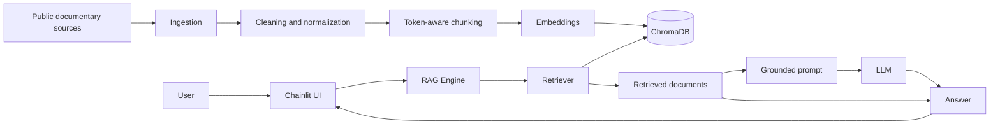

### Main components

| Component           | Responsibility                                 |
| ------------------- | ---------------------------------------------- |
| Loaders             | PDF, TXT and Markdown ingestion                |
| Cleaning            | Document normalization and cleaning            |
| Chunking            | Splitting documents into retrievable fragments |
| Embeddings          | Vector representation of document fragments    |
| ChromaDB            | Vector persistence and indexing                |
| Retriever           | Semantic retrieval and filtering               |
| RAG Engine          | Retrieval and generation orchestration         |
| LLM                 | Context-grounded answer generation             |
| Chainlit            | Conversational interface                       |
| Pydantic            | Data contracts and validation                  |
| SQLite / SQLAlchemy | Configurable UI persistence                    |
| Tests               | Component and behavior validation              |
| GitHub Actions      | Continuous integration                         |

---

# 4. RAG query flow

A query follows approximately this flow:

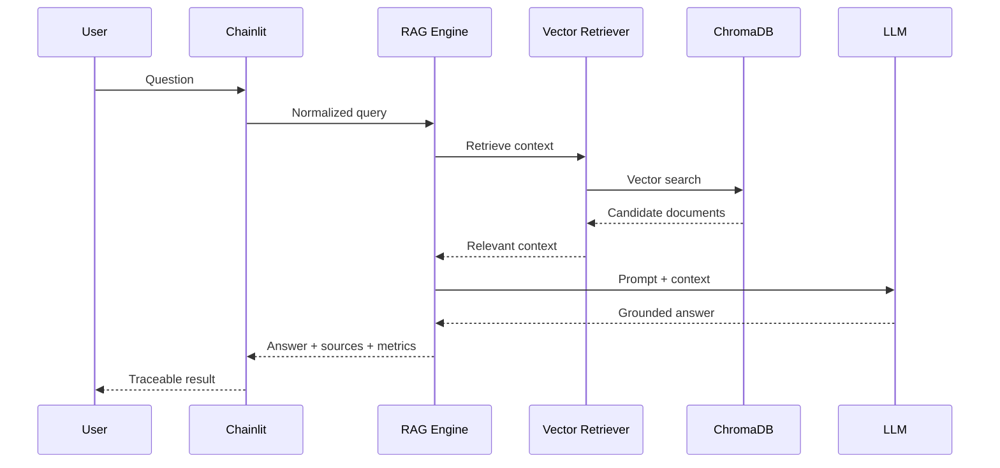

Retrieval occurs before generation.

This is important because the model receives not only the user's question but also the retrieved documentary context.

---

# 5. Grounding and traceability

One of the project's main goals is to prevent an apparently correct answer from becoming detached from its documentary evidence.

Retrieved documents can contain metadata such as:

* `doc_id`
* `tax`
* `doc_type`
* `fiscal_year`
* `section_label`
* `section_path`
* `page`
* `page_end`
* `source_url`
* `retrieved_at`
* `source_scope`
* `session_id`
* `chunk_index`

The retrieval result also preserves similarity information used during search.

The final answer can therefore be associated with the document fragments that provided its context.

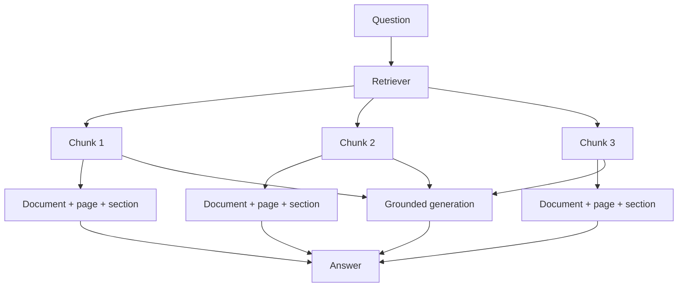

The purpose of this architecture is to make the answer inspectable through the retrieved evidence.

This does not guarantee the complete absence of hallucinations: grounding reduces risk and makes the retrieved context auditable, but generation still depends on model behavior.

---

# 6. Retrieval evaluation

Retrieval has been evaluated independently from generation.

The benchmark contains:

* **7 official documents**
* **2,847 pages**
* **40 questions**

Distribution:

| Category       | Questions |
| -------------- | --------: |
| Direct         |        28 |
| Year-dependent |         2 |
| No-answer      |         2 |
| Personal cases |         4 |
| Out-of-scope   |         4 |
| **Total**      |    **40** |

The evaluation primarily uses:

* `document-hit@k`
* `referenced-page-hit@k`

These are not referred to as Recall@k because the benchmark does not exhaustively annotate every relevant chunk in the corpus.

### Reference results

V1 configuration:

* chunk size: **256 tokens**
* overlap: **32 tokens**
* top-k: **8**
* similarity threshold: **0.82**
* embeddings: `intfloat/multilingual-e5-base`

Observed results:

| Configuration | Document hit@8 | Referenced-page hit@8 |
| ------------- | -------------: | --------------------: |
| 256 / 32      |        30 / 30 |               24 / 28 |
| 384 / 48      |        29 / 30 |               24 / 28 |
| 480 / 64      |        30 / 30 |               24 / 28 |

The **256/32** configuration was selected as V1 because it maintained the observed document retrieval performance while producing smaller chunks, reducing the amount of context that must be passed to generation.

The evaluation is supported by project-specific scripts and documentation.

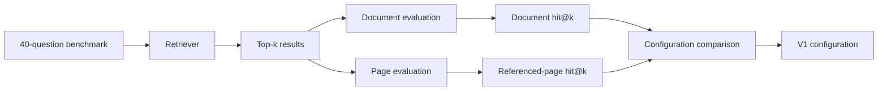

---

# 7. Technical decisions and rationale

## 7.1 LangChain

LangChain provides the abstractions used for:

* documents;
* retrievers;
* embeddings;
* component composition;
* RAG pipeline integration.

The project uses LangChain `Document` objects and compatible components.

LlamaIndex is not part of the current core implementation.

---

## 7.2 ChromaDB

ChromaDB is used as the persistent vector store.

The choice is based on:

* straightforward Python integration;
* local persistence;
* vector search support;
* reproducibility;
* suitability for the development and evaluation corpus size.

---

## 7.3 Embeddings

The selected model is:

```text
intfloat/multilingual-e5-base
```

The choice is related to its multilingual characteristics and suitability for Spanish queries and documentation.

Embedding quality directly affects retrieval quality, which is therefore evaluated indirectly through the retrieval benchmark.

---

## 7.4 Chunking

The V1 configuration uses:

```text
chunk_size = 256 tokens
chunk_overlap = 32 tokens
```

Token-based segmentation is used rather than relying exclusively on character counts.

The strategy aims to:

* avoid excessively large chunks;
* preserve sufficient context;
* reduce duplicated content;
* control the model context size;
* improve retrieval of specific documentary units.

The configuration was selected through comparison with alternative configurations.

---

## 7.5 Retrieval

V1 configuration:

```text
top_k = 8
similarity_threshold = 0.82
```

The retriever:

1. vectorizes the query;
2. queries ChromaDB;
3. retrieves candidates;
4. applies relevant filters;
5. discards results below the threshold;
6. returns LangChain documents with metadata.

The objective is to avoid passing unnecessarily large amounts of context to generation.

---

## 7.6 Chainlit

Chainlit provides the project's conversational interface.

The `ui/rag_adapter.py` layer decouples the interface from internal RAG implementation details.

This separation allows the RAG logic to be tested without directly depending on the graphical interface.

---

# 8. Prompting, abstention and response control

Generation is designed around the retrieved context.

The functional principle is:

```text
User question
      +
Retrieved context
      ↓
Grounded prompt
      ↓
Answer
```

The system must distinguish between:

* information supported by the corpus;
* insufficiently supported information;
* questions outside the documentary scope.

When the corpus does not provide sufficient evidence, the expected behavior is to abstain rather than invent an answer.

The architecture supports states such as:

* grounded answer;
* no answer;
* abstention reason;
* retrieved sources;
* latency metrics.

Abstention does not mean that the system can perfectly detect every ambiguous case. It is a control strategy that must continue to be evaluated with negative and out-of-scope cases.

---

# 9. Governance, Ethics, Safety & Security

Because the application deals with tax information, the design must account for technical and usage risks.

## Governance

The project separates:

* corpus;
* document processing;
* retrieval;
* generation;
* interface;
* evaluation.

Relevant retrieval decisions are documented through experiments and project documentation.

The corpus can be reconstructed through a source registry and download scripts.

---

## Ethics

The system should be presented as a documentary information-support tool.

It should not be interpreted as:

* professional tax advice;
* a replacement for a tax advisor;
* a legal authority;
* an automated mechanism for making binding tax decisions.

Using public sources avoids deliberately incorporating real taxpayer tax data into the development corpus.

---

## Safety

The main risk-reduction mechanisms are:

* grounding on retrieved documentation;
* source traceability;
* abstention when evidence is insufficient;
* evaluation of no-answer questions;
* evaluation of out-of-scope questions;
* separation between retrieval and generation;
* data contract validation.

The system does not guarantee the complete absence of errors or hallucinations.

---

## Security

The following aspects are considered particularly relevant:

* isolation through `source_scope`;
* session identification through `session_id`;
* data validation;
* access controls where applicable;
* separation between original documents and generated artifacts;
* exclusion of original corpus PDFs from Git.

These measures should be understood as project-level technical controls rather than a formal security certification.

---

# 10. Privacy and PII

The project includes utilities for detecting potentially identifiable information patterns in:

```text
src/privacy/pii.py
```

Current patterns include:

* IBAN;
* email;
* NIF;
* NIE;
* CIF;
* telephone numbers.

The current detection approach is primarily **pattern-based**.

It should therefore not be considered a complete semantic PII detection system or equivalent to a specialized DLP/NER solution.

Using public documentation during development and evaluation reduces the risk of exposing real taxpayer information.

The architecture also includes:

```text
source_scope
session_id
```

to support logical context separation and traceability.

---

# 11. Ingestion, corpus and metadata

The ingestion pipeline supports:

* PDF;
* TXT;
* Markdown.

The general flow is:

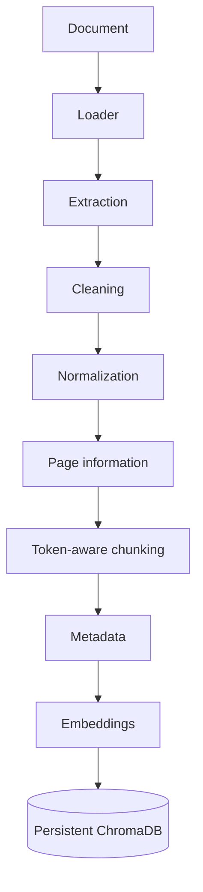

Page information is preserved when available.

Cleaning and table-handling operations are also considered to reduce corpus noise.

The source registry is maintained in:

```text
data/sources.csv
```

Original corpus documents are not included in the Git repository.

---

# 12. Repository structure

The project is organized around the following functional areas:

```text
AsesorIA/
├── data/
│   ├── eval/
│   └── sources.csv
│
├── docs/
│   ├── acceptance_criteria.md
│   ├── chunking_strategy.md
│   ├── corpus_cleaning_audit.md
│   ├── corpus_indexing.md
│   ├── embeddings.md
│   ├── retrieval_benchmark_audit.md
│   ├── retrieval_evaluation.md
│   ├── retrieval_evidence_review.md
│   ├── retrieval_threshold_experiment.md
│   ├── vector_retrieval.md
│   └── v1_retrieval_configuration.md
│
├── scripts/
│   ├── audit_corpus_cleaning.py
│   ├── audit_retrieval_benchmark.py
│   ├── benchmark_latency.py
│   ├── download_corpus.sh
│   ├── evaluate_retrieval.py
│   └── index_corpus.py
│
├── src/
│   ├── ingestion/
│   ├── indexing/
│   ├── retrieval/
│   ├── rag/
│   ├── privacy/
│   └── ...
│
├── tests/
│   ├── test_cleaning.py
│   ├── test_loaders.py
│   ├── test_chunking.py
│   ├── test_chunking_tokenizer.py
│   ├── test_tables.py
│   ├── test_embeddings.py
│   ├── test_embeddings_integration.py
│   ├── test_vectorstore.py
│   ├── test_retriever.py
│   ├── test_rag.py
│   ├── test_evaluate_retrieval.py
│   ├── test_index_corpus.py
│   ├── test_pii.py
│   ├── test_schemas.py
│   └── ...
│
├── ui/
│   ├── app.py
│   ├── rag_adapter.py
│   ├── persistence.py
│   └── mock_rag.py
│
├── requirements.txt
└── README.md
```

The exact structure may evolve with the project; the organizational principle is to separate ingestion, indexing, retrieval, generation, interface, and evaluation.

---

# 13. Installation

## Requirements

The project uses:

```text
Python 3.11
```

A virtual environment is recommended.

### Linux / macOS

```bash
python3.11 -m venv .venv
source .venv/bin/activate
pip install -r requirements.txt
```

### Windows PowerShell

```powershell
py -3.11 -m venv .venv
.venv\Scripts\Activate.ps1
pip install -r requirements.txt
```

---

# 14. Corpus download and indexing

The corpus is obtained through:

```bash
bash scripts/download_corpus.sh
```

The index can then be generated with:

```bash
python -m scripts.index_corpus --index
```

The conceptual pipeline is:

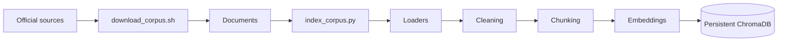

### Windows

To avoid persistence issues related to certain ChromaDB paths, an ASCII-only path is recommended, for example:

```text
C:/AsesorIA-data/chroma_db
```

The exact persistence location can be configured according to the project's persistence mechanism.

---

# 15. Execution

Once the project is installed and the index has been generated, the Chainlit interface can be started with:

```bash
cd ui
chainlit run app.py
```

The interface allows users to interact with the system through natural-language questions.

The execution flow is:

```text
User
  ↓
Chainlit
  ↓
RAG Adapter
  ↓
RAG Engine
  ↓
Retriever
  ↓
ChromaDB
  ↓
Retrieved context
  ↓
LLM
  ↓
Answer + sources + metrics
```

A mock implementation is also available for development and testing scenarios that do not require a generative model.

---

# 16. Testing and quality

The project uses `pytest`.

Full test suite:

```bash
python -m pytest tests/ -q
```

The tests cover several layers:


Covered areas include:

* loaders;
* cleaning;
* chunking;
* tokenization;
* tables;
* embeddings;
* vector store;
* retrieval;
* RAG;
* evaluation;
* indexing;
* PII;
* schemas;
* persistence and interface behavior.

Tests do not imply that the system is error-free; their purpose is to detect regressions and verify defined contracts and behaviors.

---

# 17. Continuous integration

The project uses GitHub Actions to automatically execute the test suite on relevant changes.

The conceptual flow is:


The CI configuration uses dummy credentials when an environment variable is required by tests, avoiding dependence on personal secrets.

---

# 18. Observability and latency

The RAG engine records processing metrics for queries.

The system distinguishes conceptually between:

```text
retrieval latency
generation latency
total latency
```

This makes it possible to determine whether performance issues originate from:

* vector search;
* context preparation;
* model generation;
* the combination of stages.

Observability is particularly relevant in RAG because more complex retrieval can improve evidence quality while increasing cost and latency.

---

# 19. Auditability and reproducibility

Reproducibility is one of the project's objectives.

Specific artifacts document:

* chunking strategy;
* V1 configuration;
* retrieval benchmark;
* threshold experiments;
* evidence review;
* corpus cleaning;
* indexing;
* embeddings.

Relevant scripts include:

```text
scripts/evaluate_retrieval.py
scripts/audit_corpus_cleaning.py
scripts/audit_retrieval_benchmark.py
scripts/benchmark_latency.py
scripts/index_corpus.py
```

The combination of:

```text
source registry
        +
documented configuration
        +
evaluation benchmark
        +
automated tests
        +
CI
```

supports reproduction and auditing of the project's main technical decisions.

---

# 20. Requirements coverage

The following table maps the main functional and technical requirements to their implementation.

| Requirement                  | Implementation                                                 |
| ---------------------------- | -------------------------------------------------------------- |
| End-to-end RAG system        | Ingestion + embeddings + vector store + retrieval + generation |
| Natural-language questions   | Chainlit interface                                             |
| Grounding                    | Prompt based on retrieved context                              |
| Hallucination risk reduction | Retrieval + threshold + abstention                             |
| Traceability                 | Document, section and page metadata                            |
| PDF                          | Document loader                                                |
| TXT                          | Document loader                                                |
| Markdown                     | Document loader                                                |
| Documented chunking          | `docs/chunking_strategy.md`                                    |
| Embeddings                   | `intfloat/multilingual-e5-base`                                |
| Persistent vector DB         | ChromaDB                                                       |
| Orchestration                | LangChain                                                      |
| Retrieval evaluation         | Automated benchmark                                            |
| Testing                      | pytest                                                         |
| CI                           | GitHub Actions                                                 |
| PII                          | `src/privacy/pii.py`                                           |
| Auditability                 | Scripts and documentation                                      |
| Reproducibility              | Registry + scripts + documented configuration                  |
| Security                     | Scope controls, validation and context separation              |
| Ethics                       | Abstention, traceability and usage boundaries                  |

The requirement for **dynamic document upload by end users** should not be considered fully implemented unless a dedicated implementation exists in the deployed version. The ingestion pipeline does support adding new documents to the corpus through the indexing workflow.

---

# 21. Current status

| Area                                  | Status                                                               |
| ------------------------------------- | -------------------------------------------------------------------- |
| Document ingestion                    | Implemented                                                          |
| Cleaning                              | Implemented                                                          |
| Token-aware chunking                  | Implemented                                                          |
| Embeddings                            | Implemented                                                          |
| ChromaDB                              | Implemented                                                          |
| Retriever                             | Implemented                                                          |
| RAG Engine                            | Implemented                                                          |
| Chainlit UI                           | Implemented                                                          |
| Grounding                             | Implemented                                                          |
| Traceability                          | Implemented                                                          |
| Retrieval benchmark                   | Implemented                                                          |
| PII detection                         | Implemented                                                          |
| Tests                                 | Implemented                                                          |
| CI                                    | Implemented                                                          |
| Document auditing                     | Implemented                                                          |
| Dynamic document upload from UI       | Should not be considered complete without a dedicated implementation |
| Full enterprise production deployment | Outside current scope                                                |

The project should be considered a functional and evaluable RAG implementation, rather than a fully deployed enterprise tax platform.

---

# 22. Known limitations

## 22.1 Retrieval

The current benchmark contains 40 questions and provides useful evidence for evaluating the V1 configuration, but it does not represent every possible tax-related query.

Additionally, the selected metrics do not constitute an exhaustive Recall@k evaluation over all relevant documents in the corpus.

---

## 22.2 Generation

Grounding reduces hallucination risk but does not eliminate it.

An LLM may:

* incorrectly interpret a retrieved fragment;
* combine information incorrectly;
* generate an overly general response;
* produce a conclusion that is not fully supported.

Therefore, traceability and human review remain important.

---

## 22.3 PII

Current detection is primarily pattern-based.

It is not a complete solution for:

* unstructured sensitive entities;
* implicit PII;
* information identifiable through field combinations;
* advanced semantic detection.

---

## 22.4 Regulatory updates

Tax information changes over time.

The system depends on the corpus being updated and reindexed.

Therefore, an answer can be technically correct with respect to the indexed corpus while no longer representing current regulation if the corpus is outdated.

---

## 22.5 Scope

The system does not aim to replace:

* tax advisors;
* lawyers;
* official authorities;
* administrative procedures;
* professional validation.

---

# 23. Future evolution

Natural future improvements include:

### Retrieval

* larger evaluation benchmarks;
* additional retrieval metrics;
* reranking;
* hybrid search;
* document-type-specific retrieval;
* temporal regulatory evaluation.

### Corpus

* automated source updates;
* document change detection;
* document versioning;
* validity-period control;
* broader regulatory coverage.

### PII and security

* NER for sensitive entities;
* contextual detection;
* configurable automatic redaction;
* more granular access controls;
* advanced session auditing.

### Generation

* automated groundedness evaluation;
* citation verification;
* claim validation;
* improved abstention strategies;
* systematic provider/model comparison.

### Product

* document upload through the interface;
* corpus management;
* source administration;
* advanced history;
* evidence visualization;
* production observability.

---

# 24. Conclusion

AsesorIA implements a RAG system for querying Spanish tax and regulatory information.

The architecture prioritizes:

```text
Retrieval
    ↓
Evidence
    ↓
Grounded generation
    ↓
Traceability
    ↓
Evaluation
```

Chunking and retrieval decisions were not established solely from theoretical assumptions, but were compared through a documentary benchmark.

The V1 configuration uses:

```text
Embedding model:
intfloat/multilingual-e5-base

Chunk size:
256 tokens

Overlap:
32 tokens

Top-k:
8

Similarity threshold:
0.82
```

The system also incorporates automated testing, CI, experiment documentation, basic PII controls and source traceability.

Its main objective is to demonstrate a reproducible and evaluable RAG architecture in which retrieval quality is prioritized before generation.
